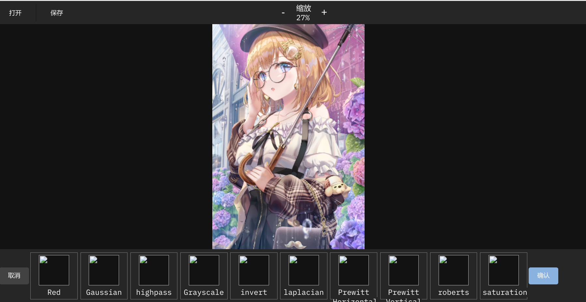

# web 第四次作业

使用 lena.js 做了一个滤镜编辑图片网页, 在首页点击图片即可进入编辑页面



完成点:

- 滤镜
- 缩放

思路: 

很多的 button 标签, 点击调用函数.

 为了实现缩放, 图片一开始就绘制在了 canvas 画布上, 利用了 lena.js 的 `redrawCanvas` api 对图像加滤镜.

缩放实现:

```js
const zoom_in = () => {
    const digit = document.getElementById("scale_rate");
    const val = Number(digit.innerText.slice(0, -1));
    digit.innerText =
        val + 5 <= 300 &&
        img_promise.then((res) => {
        paint(res, originalImage, (val + 5) / 100);
        paint(res, filteredImageCanvas, (val + 5) / 100);
    })
        ? `${val + 5}%`
    : "300%";
};
const zoom_out = () => {
    const digit = document.getElementById("scale_rate");
    const val = Number(digit.innerText.slice(0, -1));
    digit.innerText =
        val - 5 >= 10 &&
        img_promise.then((res) => {
        paint(res, originalImage, (val - 5) / 100);
        paint(res, filteredImageCanvas, (val - 5) / 100);
    })
        ? `${val - 5}%`
    : "10%";
};


```

使用 promise, 因为图像加载不是一下子好的: 

```js
const paint = (img, dom, rate) => {
    dom.height = img.height * rate;
    dom.width = img.width * rate;
    let ctx = dom.getContext("2d");
    ctx.scale(rate, rate);
    ctx.drawImage(img, 0, 0, img.width, img.height);
};

// 如果想拿到 Promise 的东西, 得返回 Promise 然后 then
function __picWM({ url = "", dom = null } = {}) {
    return new Promise((resolve, reject) => {
        const img = new Image();
        img.src = url;
        img.crossOrigin = "anonymous";
        img.onload = function () {
            const rate = (screen.height * 0.6) / img.height;
            const digit = document.getElementById("scale_rate");
            digit.innerText = `${rate * 100}`.slice(0, 2) + "%";

            paint(img, dom, rate);
            resolve(img);
        };
    });
}
```

使用方法:

- 起一个 live-server
