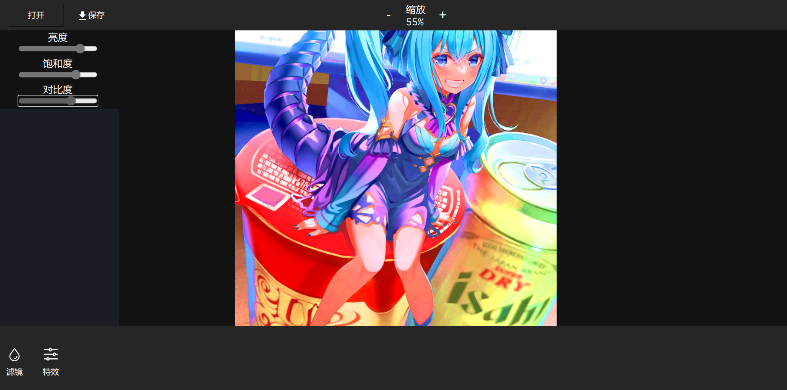

# web 第四次作业

纯前端原生 Javascript 实现的一个滤镜编辑图片网页, 在首页点击图片即可进入编辑页面



完成点:

- 滤镜
- 缩放
- 亮度/饱和度/对比度调整

demo: https://auth.bilibilianime.com

## 依赖

- lena.js 滤镜

## 说明

### 缩放 

 为了实现缩放, 图片一开始就绘制在了 canvas 画布上, 利用了 lena.js 的 `redrawCanvas` api 对图像加滤镜.

缩放实现:

```js
const zoom_in = () => {
    const digit = document.getElementById("scale_rate");
    const val = Number(digit.innerText.slice(0, -1));
    digit.innerText =
        val + 5 <= 300 &&
        img_promise.then((res) => {
        paint(res, originalImage, (val + 5) / 100);
        paint(res, filteredImageCanvas, (val + 5) / 100);
    })
        ? `${val + 5}%`
    : "300%";
};
const zoom_out = () => {
    const digit = document.getElementById("scale_rate");
    const val = Number(digit.innerText.slice(0, -1));
    digit.innerText =
        val - 5 >= 10 &&
        img_promise.then((res) => {
        paint(res, originalImage, (val - 5) / 100);
        paint(res, filteredImageCanvas, (val - 5) / 100);
    })
        ? `${val - 5}%`
    : "10%";
};


```

使用 promise, 因为图像加载不是一下子好的: 

```js
const paint = (img, dom, rate) => {
    dom.height = img.height * rate;
    dom.width = img.width * rate;
    let ctx = dom.getContext("2d");
    ctx.scale(rate, rate);
    ctx.drawImage(img, 0, 0, img.width, img.height);
};

// 如果想拿到 Promise 的东西, 得返回 Promise 然后 then
function __picWM({ url = "", dom = null } = {}) {
    return new Promise((resolve, reject) => {
        const img = new Image();
        img.src = url;
        img.crossOrigin = "anonymous";
        img.onload = function () {
            const rate = (screen.height * 0.6) / img.height;
            const digit = document.getElementById("scale_rate");
            digit.innerText = `${rate * 100}`.slice(0, 2) + "%";

            paint(img, dom, rate);
            resolve(img);
        };
    });
}
```

### 亮度

亮度究竟指 HSB(HSV) 中的 Brightness 还是 HSL 中的 Lightness 我也不清楚, 就按 HSB 的做了. 因为在 PS 中亮度对比度面板调整的其实是 HSB.

HSB 和 RGB 互相转化:

```js
const rgb2hsv = (r, g, b) => {
      const r1 = r / 255;
      const g1 = g / 255;
      const b1 = b / 255;
      const cmax = Math.max(r1, g1, b1);
      const cmin = Math.min(r1, g1, b1);

      const delta = cmax - cmin;

      let h = !delta
        ? 0
        : cmax === r1
        ? (1 / 6) * ((g1 - b1) / delta + 0)
        : cmax === g1
        ? (1 / 6) * ((b1 - r1) / delta + 2)
        : (1 / 6) * ((r1 - g1) / delta + 4);
      let s = !cmax ? 0 : delta / cmax;
      let v = cmax;

      if (h < 0) h += 1;

      return [h, s, v];
    };
    // h: 0~1 , rgb 均在 0~255
    const hsv2rgb = (h, s, v) => {
      let r, g, b;
      h *= 6;
      i = Math.floor(h);
      const f = h - i;
      const p = v * (1 - s);
      const q = v * (1 - s * f);
      const t = v * (1 - s * (1 - f));
      switch (i) {
        case 0:
          r = v;
          g = t;
          b = p;
          break;
        case 1:
          r = q;
          g = v;
          b = p;
          break;
        case 2:
          r = p;
          g = v;
          b = t;
          break;
        case 3:
          r = p;
          g = q;
          b = v;
          break;
        case 4:
          r = t;
          g = p;
          b = v;
          break;
        default:
          // case 5:
          r = v;
          g = p;
          b = q;
          break;
      }

      r *= 255;
      g *= 255;
      b *= 255;
      r = r > 255 ? 255 : parseInt(r);
      g = g > 255 ? 255 : parseInt(g);
      b = b > 255 ? 255 : parseInt(b);
      return [r, g, b];
    };

```

调整算法: 直接改 Brightness 就行, 范围 [0,1]

### 饱和度

在 PS 的 色相/饱和度/明度 面板中使用的是 HSL.

HSL 和 RGB 互相转化:

```js
const rgb2hsl = (r, g, b) => {
      const r1 = r / 255;
      const g1 = g / 255;
      const b1 = b / 255;
      const cmax = Math.max(r1, g1, b1);
      const cmin = Math.min(r1, g1, b1);

      const delta = cmax - cmin;

      let l = (cmin + cmax) / 2;
      let h = !delta
        ? 0
        : cmax === r1
        ? (1 / 6) * ((g1 - b1) / delta + 0)
        : cmax === g1
        ? (1 / 6) * ((b1 - r1) / delta + 2)
        : (1 / 6) * ((r1 - g1) / delta + 4);
      let s =
        l === 0 || delta === 0
          ? 0
          : 0 < l && l <= 1 / 2
          ? delta / (2 * l)
          : delta / (2 - 2 * l);

      if (h < 0) h += 1;
      return [h, s, l];
    };
    const hsl2rgb = (h, s, l) => {
      const res = [];
      const rgb = [];
      if (s === 0) {
        rgb[0] = Math.round(l * 255);
        rgb[1] = Math.round(l * 255);
        rgb[2] = Math.round(l * 255);
      } else {
        const q = l < 0.5 ? l*(1 + s) : l + s - l * s;
        const p = 2 * l - q;
        res[0] = h + 1 / 3;
        res[1] = h;
        res[2] = h - 1 / 3;
        res.forEach((c) => {

          c = c < 0 ? c + 1 : c > 1 ? c - 1 : c;
          switch (true) {
            case c < 1 / 6:
              c = p + (q - p) * 6 * c;
              break;
            case 1 / 6 <= c && c < 0.5:
              c = q;
              break;
            case 0.5 <= c && c < 2 / 3:
              c = p + (q - p) * (4 - 6 * c);
              break;
            default:
              c = p;
          }
          rgb.push(Math.round(c*255));
        });
        
      }
      return rgb;
    };
```

调整算法: 直接改 S(saturation) 即可, 范围: [0,1]

### 对比度

公式:

```
rgb + (rgb - threshold) * contrast / 255
```

threshold 指平均亮度, 可粗略认为等于 127

contrast 指对比度, 范围 [-100, 100]

## 使用方法

起一个 live-server
